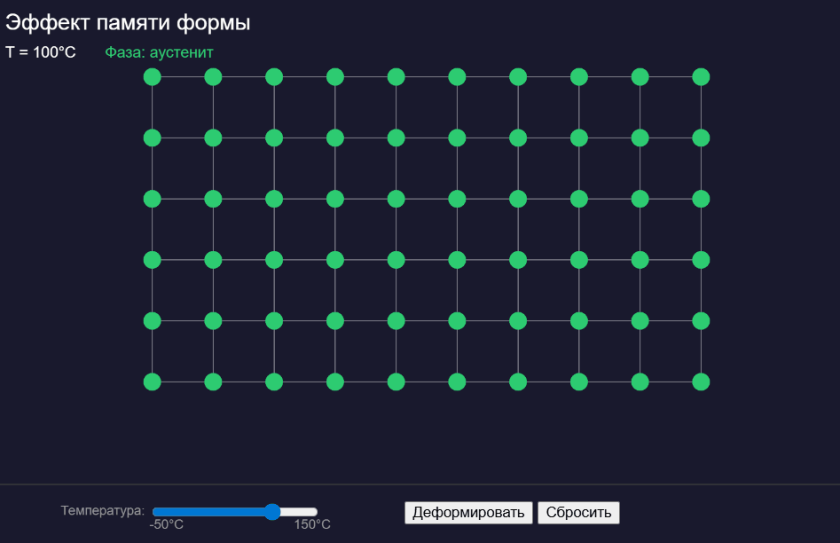

# Эффект памяти формы — Визуализация

Интерактивная визуализация мартенситного превращения в сплаве NiTi (нитинол) на p5.js.



## О явлении

**Эффект памяти формы (ЭПФ)** — способность материала восстанавливать свою первоначальную форму при нагреве после пластической деформации.

### Физика процесса

В основе эффекта лежит **мартенситное превращение** — бездиффузионная перестройка кристаллической решётки:

| Фаза | Температура | Структура | Свойства |
|------|-------------|-----------|----------|
| Аустенит | > 80°C | Кубическая B2 | Жёсткая, упругая |
| Мартенсит | < 30°C | Моноклинная B19' | Мягкая, легко деформируется |

### Цикл эффекта памяти

```
Аустенит (горячий) → Охлаждение → Мартенсит (холодный)
                                        ↓
                                   Деформация
                                        ↓
Форма восстановлена ← Нагрев ← Деформированный мартенсит
```

## Демонстрация

### Аустенит (T > 80°C)
Высокотемпературная фаза. Решётка стабильна, деформация невозможна.

### Мартенсит (T < 30°C)
Низкотемпературная фаза. Решётка легко деформируется через механизм двойникования.

### Восстановление
При нагреве выше 80°C деформированная решётка возвращается к исходной форме.

## Запуск

### Способ 1: Локально
1. Скачайте `index.html`
2. Откройте в браузере

### Способ 2: p5.js Web Editor
1. Откройте [editor.p5js.org](https://editor.p5js.org/)
2. Создайте новый проект
3. Замените содержимое `sketch.js` на код из файла
4. Нажмите Play

## Управление

| Элемент | Действие |
|---------|----------|
| Слайдер | Изменение температуры (-50°C ... 150°C) |
| Кнопка "Деформировать" | Сдвиговая деформация решётки (только в мартенсите) |
| Кнопка "Сбросить" | Возврат к начальному состоянию |

## Использованные концепции

### Массивы
```javascript
let atoms = [];           // массив атомов
let bonds = [];           // массив связей
let startPositions = [];  // начальные позиции
```

### Циклы
```javascript
// Двойной цикл для создания решётки
for (let i = 0; i < rows; i++) {
  for (let j = 0; j < cols; j++) {
    // создание атомов
  }
}
```

### Условные операторы
```javascript
// Определение фазы по температуре
if (temperature < Ms) {
  phase = "мартенсит";
} else if (temperature > Af) {
  phase = "аустенит";
} else {
  phase = "переход";
}
```

### Функции
- `setup()` — инициализация
- `createLattice()` — создание решётки
- `draw()` — главный цикл отрисовки
- `deform()` — деформация решётки
- `restoreShape()` — восстановление формы
- `drawAtoms()` — отрисовка атомов
- `drawBonds()` — отрисовка связей

## Структура проекта

```
shape-memory-effect/
├── index.html    # HTML страница с встроенным кодом
├── sketch.js     # Код для p5.js редактора
├── README.md     # Описание проекта
└── demo.gif      # Демонстрация работы
```

## Технологии

- [p5.js](https://p5js.org/) — библиотека для визуализации

## Источники

1. Otsuka K., Wayman C.M. Shape Memory Materials. Cambridge University Press, 1999
2. Jani J.M. et al. A review of shape memory alloy research. Materials & Design, 2014

## Автор

Курсовая работа по дисциплине "Компьютерные технологии в материаловедении"
